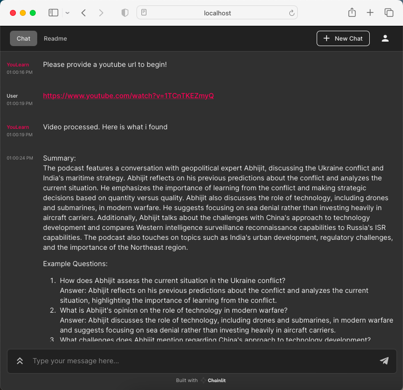
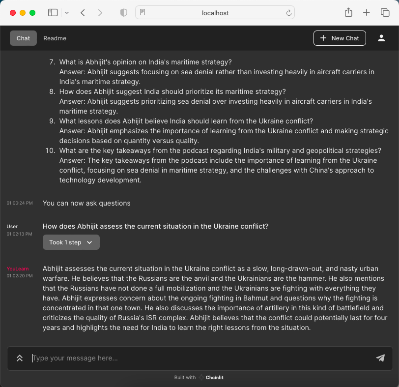

# YouLearn

A YouTube based learning bot, that can summarize a youtube video (based on captions) and then answer questions on the video based on the data it has learnt. It can be very effective in new learning content from youtube videos. and then act as a QA bot based on the content

Here are the screenshots, where it is summarizing and answering questions based on the amazing podcast between Abhijit Chawda and Abhijit Iyer-Mitra

https://www.youtube.com/watch?v=1TCnTKEZmyQ

| Summarizing Mode    | QA Mode |
| -------- | ------- |
|   |     |

# How to run

* Prepare a venv
```bash
python -m venv venv
source venv/bin/activate
```

* Install the dependencies
```bash
pip3 import -r requirements.txt
```

* Execute it as below
```bash
export OPENAI_API_KEY=...
chainlit run app.py
```
